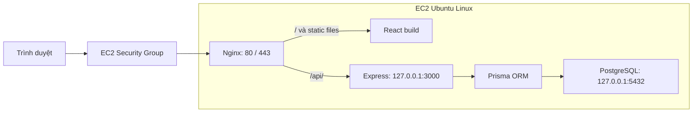

# Quyết định web technology stack

Issue: [#7 — WEB-01: Select Web Technology Stack](https://github.com/LVTIT/PBL4-517/issues/7).

**Trạng thái: Đã thống nhất ngày 14/09/2026.** Người dùng xác nhận lựa chọn stack cho nhóm và yêu cầu hoàn thành issue #7, commit vào `main`. Nhóm đã dùng TypeScript ở PBL3. Tài liệu này là đầu vào cho việc tạo website ở issue #8.

## Bối cảnh và tiêu chí

PBL4-517 tập trung vào Linux, AWS, scanner bên ngoài và kiểm thử bảo mật. Website thương mại điện tử cần đủ chức năng để triển khai, giám sát và kiểm thử; ở W1–W2, issue #8 yêu cầu trang chủ, đăng nhập và danh sách sản phẩm.

Ưu tiên tận dụng kinh nghiệm TypeScript, dễ bàn giao cho ba thành viên, hỗ trợ dữ liệu quan hệ và triển khai trên một EC2 bằng Linux service. Kinh nghiệm TypeScript chưa đồng nghĩa nhóm đã biết React hoặc Express; cần dành thời gian làm quen hai thư viện này.

## Stack đã chọn

| Thành phần | Lựa chọn | Vai trò |
| --- | --- | --- |
| Frontend | React + TypeScript + Vite, CSS thuần | Xây dựng giao diện theo component; Vite phục vụ phát triển và build static files |
| Backend | Node.js 24 LTS + Express 5 + TypeScript | REST API cho đăng nhập, sản phẩm và nghiệp vụ |
| Database | PostgreSQL 16 ở local và EC2 | Lưu tài khoản, sản phẩm; mở rộng đơn hàng và chi tiết đơn hàng |
| Truy cập dữ liệu | Prisma ORM 7 | Schema, migration và client có kiểu dữ liệu cho TypeScript |
| Web server | Nginx | Phục vụ frontend đã build và reverse proxy đường dẫn `/api/` tới backend |
| Hệ điều hành đích | Ubuntu Server 24.04 LTS trên EC2 | Môi trường dự kiến; đồng bộ với người phụ trách issue #6 |
| Quản lý tiến trình | systemd | Chạy backend Node.js, tự khởi động, restart và xem log |

Dùng bản vá được hỗ trợ mới nhất trong dòng Node.js 24 LTS. Khi tạo skeleton, chọn phiên bản React/Vite/TypeScript tương thích với Node và Prisma, ghi dependency vào `package.json`, commit `package-lock.json` và dùng `npm ci` để cài lại. Khóa Prisma CLI và client cùng phiên bản 7.x; đối chiếu hướng dẫn đúng major thay vì trộn ví dụ giữa các phiên bản. Xem [Node.js releases](https://nodejs.org/en/about/previous-releases), [Vite guide](https://vite.dev/guide/) và [Prisma system requirements](https://docs.prisma.io/docs/orm/reference/system-requirements).

## Lý do lựa chọn và đánh đổi

- TypeScript dùng ở cả frontend và backend giúp tận dụng kiến thức PBL3. Kiểu dữ liệu hỗ trợ phát triển nhưng API vẫn phải kiểm tra dữ liệu đầu vào lúc chạy.
- React phù hợp các trang sản phẩm, đăng nhập và các phần tương tác có thể bổ sung sau này. Vite có template React/TypeScript và tạo bản build static; trên EC2, frontend không cần một tiến trình Node riêng. Xem [Vite guide](https://vite.dev/guide/) và [static deployment](https://vite.dev/guide/static-deploy.html).
- Express có phạm vi nhỏ, phù hợp API cơ bản. Đổi lại, nhóm phải chọn và cấu hình validation, xác thực, phân quyền và xử lý lỗi; Express không cung cấp sẵn một hệ thống tài khoản hoàn chỉnh.
- PostgreSQL phù hợp dữ liệu có quan hệ như người dùng, sản phẩm và đơn hàng. Dùng cùng database ở local và EC2 giúp giảm khác biệt môi trường; mỗi thành viên phải cài hoặc chạy thêm dịch vụ database.
- Prisma giúp quản lý schema và migration cùng source TypeScript. Nhóm cần học thêm công cụ này, hiểu SQL được tạo ra và kiểm tra migration trước khi áp dụng.
- Frontend SPA có thêm bước build và hợp đồng API; việc tối ưu SEO sẽ cần xem xét lại nếu trở thành yêu cầu chính. Với demo hiện tại, ưu tiên chức năng và triển khai.
- Backend và database cùng một EC2 giúp đơn giản hóa demo nhưng chia sẻ tài nguyên và cùng chịu ảnh hưởng khi instance gặp sự cố. Cần đo RAM/CPU ở bước triển khai và có cách sao lưu dữ liệu.

So sánh dưới đây là đánh giá theo phạm vi dự án và kinh nghiệm nhóm, không phải benchmark:

| Phương án | Điểm phù hợp | Đánh đổi | Đề xuất |
| --- | --- | --- | --- |
| React/Vite + Express + PostgreSQL | Dùng TypeScript xuyên suốt, phân biệt rõ giao diện/API/Linux service | Tự tích hợp xác thực và quản lý hai phần source | Chọn cho W1–W2 |
| Framework React full stack | Có thể gom giao diện và logic server, phù hợp khi cần render phía server | Cần học thêm quy ước framework và cơ chế render | Xem xét khi nhóm có kinh nghiệm hoặc cần SEO |
| Django Templates + PostgreSQL | Có sẵn nhiều thành phần cho web cơ bản | Học thêm Python/Django, ít tận dụng TypeScript PBL3 | Phương án thay thế |

## Khả năng triển khai trên Linux EC2

**Kết luận ở mức tài liệu: stack có đường triển khai phù hợp trên EC2 Linux. Chưa có kết quả chạy thử trên Linux hoặc EC2 trong issue này.**

| Kiểm tra tương thích | Căn cứ | Kết quả |
| --- | --- | --- |
| Ubuntu trên EC2 | [Ubuntu AMI chính thức](https://ubuntu.com/aws/docs/aws-how-to/instances/find-ubuntu-images/) | Có image Ubuntu; chọn đúng region và kiến trúc instance |
| Node.js và Express | [Node.js releases](https://nodejs.org/en/about/previous-releases), [Express FAQ](https://expressjs.com/en/starter/faq/) | Node.js 24 thuộc dòng LTS và đáp ứng yêu cầu Node.js 18 trở lên của Express 5 |
| Frontend static | [Vite deployment](https://vite.dev/guide/static-deploy.html) | Build ra `dist/`; Nginx có thể phục vụ các file này |
| Prisma và PostgreSQL | [Prisma system requirements](https://docs.prisma.io/docs/orm/reference/system-requirements), [supported databases](https://docs.prisma.io/docs/orm/reference/supported-databases) | Có hỗ trợ Node.js 24 và PostgreSQL 16; kiểm tra yêu cầu cụ thể của bản 7.x khi khóa dependency |
| PostgreSQL trên Ubuntu | [PostgreSQL Ubuntu packages](https://www.postgresql.org/download/linux/ubuntu/) | Có gói cài trên Ubuntu |
| Backend qua reverse proxy và service | [Express production practices](https://expressjs.com/en/advanced/best-practice-performance/) | Có hướng dẫn dùng reverse proxy và systemd |
| Truy cập web/SSH trên EC2 | [AWS Security Group rules](https://docs.aws.amazon.com/AWSEC2/latest/UserGuide/security-group-rules-reference.html) | Có quy tắc HTTP, HTTPS và SSH tương ứng |

Luồng triển khai dự kiến cho riêng website; sơ đồ toàn hệ thống thuộc issue #11:

Quy ước cho các issue triển khai tiếp theo:

- Source dự kiến: `website/frontend/` chứa React/Vite; `website/backend/` chứa Express và thư mục Prisma/migration. Đây là cấu trúc đề xuất, chưa được tạo.
- Local: frontend dùng Vite dev server, proxy `/api/` tới backend. Frontend gọi API bằng đường dẫn tương đối để giữ cùng cách gọi khi deploy.
- Production: build frontend và biên dịch backend TypeScript sang JavaScript. Nginx phục vụ frontend; systemd chạy backend bằng `node` với user ứng dụng và `NODE_ENV=production`. Chốt tên entrypoint và scripts trong issue #8/#13.
- Backend định nghĩa route có tiền tố `/api/`; Nginx giữ nguyên tiền tố khi proxy. SPA fallback về `index.html` chỉ áp dụng cho frontend, không áp dụng cho API. Không dùng Vite dev server hoặc `vite preview` làm server production.
- Cài dependency và tạo Prisma client trên môi trường đích; chạy migration đã commit bằng `prisma migrate deploy`. Không sao chép `node_modules` từ Windows lên Linux.
- Đăng nhập dự kiến dùng session phía server với cookie HttpOnly, lưu session trong PostgreSQL. Backend cần password hashing, validation, kiểm tra quyền, bảo vệ CSRF và giới hạn thử đăng nhập. Cấu hình cookie Secure khi dùng HTTPS và `trust proxy` phù hợp với Nginx.
- Secret, mật khẩu database và cấu hình session đặt ở môi trường backend; chỉ commit file mẫu. Các biến `VITE_*` có thể xuất hiện trong frontend build, vì vậy không chứa secret.
- Security Group: TCP 80 cho HTTP, TCP 443 khi cấu hình TLS, TCP 22 chỉ từ IP quản trị cần thiết. Backend bind loopback; không mở 3000 hoặc 5432 ra Internet. Nếu scanner cần thấy port 22 mở, IP nguồn phải nằm trong phạm vi được phép.
- Scanner kiểm tra host qua mạng, không cần truy cập database hoặc dùng cùng ngôn ngữ với website.

### Kiểm chứng thực tế ở các issue tiếp theo

| Issue | Việc cần thực hiện | Evidence mong đợi |
| --- | --- | --- |
| #8, #13 | Tạo skeleton, khóa dependency, kết nối PostgreSQL, chạy migration và build từ bản clone sạch | Lệnh chạy local; trang chủ, đăng nhập và sản phẩm hoạt động |
| #12, #14 | Cài Node/PostgreSQL, triển khai bản build, cấu hình Nginx và API proxy | Phiên bản runtime/database, `nginx -t`, phản hồi frontend và API từ ngoài EC2 |
| #15 | Tạo systemd service, enable, restart và reboot | `systemctl status`, log `journalctl`, website/API hoạt động lại sau reboot |
| #16, #17 | Kiểm tra chức năng, port listen, Security Group và tài liệu deploy | Kết quả `ss`, kiểm thử từ bên ngoài, evidence trong `evidence/W02/` |

## Phạm vi theo đề tài 517

- Website demo hướng tới sản phẩm, đăng nhập, giỏ hàng, đơn hàng và quản trị. Issue #8 bắt đầu với trang chủ, đăng nhập và danh sách sản phẩm; các chức năng còn lại cần được lập kế hoạch riêng.
- Sau bước chạy trực tiếp trên EC2, bổ sung kiến trúc có Application Load Balancer và thiết kế VPC, subnet, Security Group, Network ACL. ALB chuyển request tới Nginx trên EC2; cấu hình truy cập EC2 từ Security Group của ALB và cập nhật proxy/HTTPS theo kiến trúc thực tế. Đây là phạm vi triển khai tiếp theo, chưa hoàn thành trong issue #7.
- Scanner chạy từ bên ngoài, lưu trạng thái các cổng theo từng host: lần đầu cảnh báo các cổng đang mở, các lần tiếp theo cảnh báo cổng mới mở qua Telegram/Discord. Cổng mở là kết quả giám sát mạng, không tự chứng minh website có lỗ hổng OWASP.
- Lập tình huống kiểm thử bảo mật gắn với đăng nhập, quyền xem đơn hàng, quyền quản trị, tìm kiếm và nội dung người dùng. Chọn và ghi rõ phiên bản OWASP Top 10 dùng cho báo cáo; lưu bằng chứng khai thác, thay đổi khắc phục và kiểm thử lại từng tình huống.
- Nếu cần phiên bản có lỗi để thực hành, dùng môi trường lab giới hạn truy cập với dữ liệu giả và lưu phiên bản trước/sau sửa. Kết quả kiểm thử lại xác nhận tình huống đã được chặn, không khẳng định hệ thống hết mọi lỗ hổng.

Tham khảo: [AWS Application Load Balancer](https://docs.aws.amazon.com/elasticloadbalancing/latest/application/introduction.html), [OWASP Top 10](https://owasp.org/www-project-top-ten/), [Express security practices](https://expressjs.com/en/advanced/best-practice-security/).

## Ghi nhận thống nhất và hoàn thành issue #7

Ngày 14/09/2026, sau khi đối chiếu toàn bộ đề tài và kinh nghiệm TypeScript của nhóm, người dùng xác nhận trong phiên làm việc: “Ok thống nhất và hoàn thành issue 7 đi, cũng như là commits vào main.” Đây là căn cứ ghi nhận quyết định; không ghi nhận xác nhận riêng lẻ thay cho từng thành viên.

Checklist đối chiếu issue:

- [x] Có đề xuất web stack và lý do lựa chọn.
- [x] Xác định frontend.
- [x] Xác định backend.
- [x] Xác định database.
- [x] Đối chiếu khả năng triển khai Linux EC2 bằng tài liệu chính thức; kiểm thử thực tế còn chờ các issue triển khai.
- [x] Thống nhất stack theo xác nhận của người dùng ngày 14/09/2026, được ghi lại ở trên.
- [x] Ghi quyết định cuối cùng trong `docs/README.md` và liên kết từ README chính.

Issue #7 hoàn thành ở phạm vi lựa chọn công nghệ và đối chiếu khả năng triển khai. Việc tạo source, chạy thử Linux/EC2 và thu thập evidence tiếp tục ở các issue #8, #12–#17 như bảng trên.
