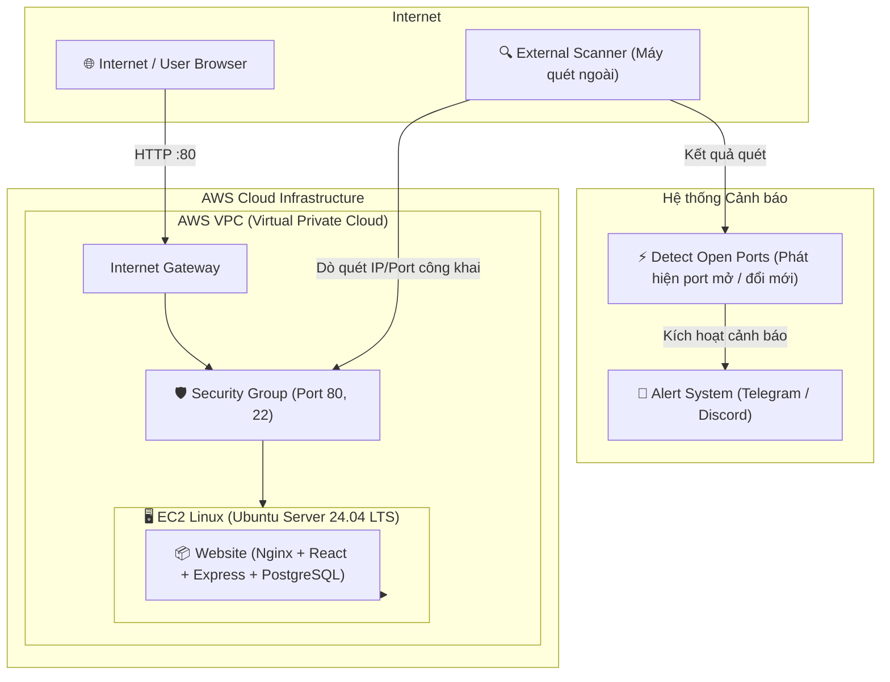
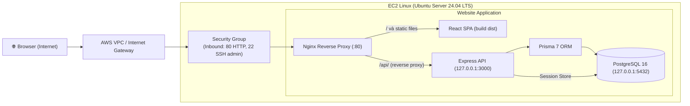
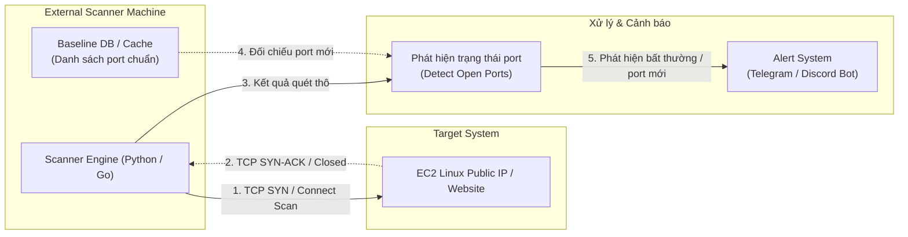

# Architecture v0.1 — PBL4-517

> **Issue:** [#11 — DOC-01: Create Architecture v0.1](https://github.com/LVTIT/PBL4-517/issues/11)  
> **Ngày tạo:** 2026-09-20 | **Trạng thái:** Bản nháp v0.1 hoàn thiện để nhóm review và xác nhận DoD  
> **Tài liệu tham chiếu canonical:** [wiki/ARCHITECTURE.md](../../wiki/ARCHITECTURE.md)  
> *Lưu ý: File này là snapshot v0.1 lưu tại `docs/architecture/` theo yêu cầu dự án.*

---

## 1. Mục tiêu và Sơ đồ tổng quan (High-Level Architecture)

Tạo sơ đồ kiến trúc ban đầu của hệ thống PBL4 nhằm thống nhất hướng triển khai giữa 3 thành viên:
- **Luồng dịch vụ (AWS side):** Người dùng từ Internet truy cập website an toàn qua hạ tầng AWS.
- **Luồng giám sát (Scanner side):** Scanner độc lập từ bên ngoài dò quét port định kỳ và cảnh báo tự động khi có bất thường.

### Sơ đồ kiến trúc tổng thể

---

## 2. Chi tiết AWS side — Website trên EC2

Kiến trúc triển khai chi tiết đáp ứng chuỗi luồng:  
**`Internet → AWS VPC → Security Group → EC2 Linux → Website`**

### Nguyên tắc bảo mật và luồng dữ liệu:
1. **AWS VPC & Internet Gateway:** Định tuyến lưu lượng Internet công khai vào Public Subnet của VPC.
2. **Security Group:** Lớp firewall trạng thái ở tầng instance, chỉ cho phép:
   - `Port 80 (HTTP)`: Mở cho mọi người dùng truy cập web.
   - `Port 22 (SSH)`: Giới hạn nghiêm ngặt theo IP quản trị của các thành viên.
   - Các port nhạy cảm (`3000`, `5432`) tuyệt đối **không** mở ra ngoài.
3. **Nginx:** Tiếp nhận request từ port 80, phục vụ trực tiếp static asset của React và reverse proxy các request `/api/` về Express.
4. **Cô lập nội bộ (Loopback):** Cả Express và PostgreSQL đều bind `127.0.0.1`, đảm bảo không thể bị kết nối trái phép trực tiếp từ Internet.

---

## 3. Chi tiết Scanner side và Alert flow

Kiến trúc quét và cảnh báo đáp ứng chuỗi luồng:  
**`External Scanner → EC2 / Website → Detect open ports → Alert system`**

### Quy trình hoạt động:
1. **Dò quét độc lập:** Scanner chạy từ máy ngoài (máy cục bộ thành viên hoặc VPS bên ngoài), hoàn toàn không phụ thuộc mã nguồn hay DB của Website.
2. **Detect open ports:** 
   - Lần đầu: Ghi nhận danh sách port đang mở (baseline dự kiến: 80, có thể có 22).
   - Các lần định kỳ: Đối chiếu với baseline. Nếu phát hiện port lạ/mới mở (ví dụ: vô tình mở 3000, 5432, 8080) thì đánh dấu sự kiện bất thường.
3. **Alert system:** Gửi thông báo ngay lập tức qua webhook của Telegram / Discord với đầy đủ thông tin: IP mục tiêu, port mới phát hiện, thời gian quét.

---

## 4. Bảng thành phần hệ thống

| Thành phần | Vai trò trong v0.1 | Issue liên quan |
| :--- | :--- | :--- |
| **Internet / Browser** | Người dùng cuối truy cập giao diện cửa hàng e-commerce | Toàn bộ dự án |
| **AWS VPC** | Môi trường mạng ảo cô lập, quản lý IP và Subnet trên AWS | Issue #12 |
| **Security Group** | Tường lửa quản lý Inbound/Outbound rules cho EC2 | Issue #12 |
| **EC2 Linux** | Máy chủ Ubuntu Server 24.04 LTS chạy website | Issue #12, #14 |
| **Nginx** | Reverse proxy, static file server, kiểm soát đầu vào HTTP | Issue #14 |
| **Website Application** | React frontend + Express API + PostgreSQL 16 (Secure Baseline) | Issue #8, #13 |
| **External Scanner** | Module quét cổng từ bên ngoài, độc lập với website | Issue #9, #10 |
| **Alert System** | Bot gửi tin nhắn cảnh báo tức thì qua Telegram / Discord | Issue #10 |

---

## 5. Ranh giới phiên bản v0.1 (Scope & Boundaries)

- **Có trong v0.1:**
  - Một EC2 chạy toàn bộ website (monolithic trên 1 VM) với Nginx proxy.
  - Security Group cơ bản (chỉ mở port 80 và 22 có kiểm soát).
  - External scanner quét port TCP bên ngoài và gửi alert cơ bản.
  - Baseline e-commerce có CSRF, HttpOnly session, chống IDOR trên `main`.
- **Chưa có trong v0.1 (thuộc các giai đoạn mở rộng sau):**
  - Application Load Balancer (ALB), Auto Scaling Group.
  - HTTPS / chứng chỉ TLS (Let's Encrypt / Certbot - dự kiến ở các issue tiếp theo).
  - Multi-AZ VPC / Private Subnet riêng biệt cho Database.
  - Quét lỗ hổng tầng ứng dụng nâng cao (DAST/SAST chuyên sâu).

---

## 6. Đối chiếu Checklist & Definition of Done (DoD)

### Checklist nhiệm vụ:
- [x] **Vẽ AWS side:** Đã mô tả chi tiết từ VPC, Security Group đến EC2 và Website Stack (Mục 2).
- [x] **Vẽ scanner side:** Đã mô tả cơ chế quét ngoài và đối chiếu baseline (Mục 3).
- [x] **Vẽ alert flow:** Đã mô tả luồng gửi tin tức thì tới Telegram/Discord (Mục 3).
- [x] **Lưu vào `docs/architecture/`:** Đã lưu file chuẩn tại `docs/architecture/v0.1.md`.
- [ ] **Thống nhất với nhóm:** 3 thành viên cần review và ký xác nhận bên dưới.

### Ma trận trách nhiệm & Xác nhận hiểu sơ đồ (DoD):

| Thành viên | Trách nhiệm chính theo kiến trúc | Trạng thái hiểu sơ đồ |
| :--- | :--- | :---: |
| **Thành viên 1** (Toàn / Cloud Admin) | Cấu hình AWS VPC, Security Group, provisioning EC2, Nginx | `[ ] Confirmed` |
| **Thành viên 2** (Web & App Security) | Hoàn thiện source Website (React/Express/DB), Secure baseline | `[ ] Confirmed` |
| **Thành viên 3** (Scanner & Alert Dev) | Xây dựng công cụ External Scanner, logic phát hiện port & Alert bot | `[ ] Confirmed` |

> ⚠️ **Quy tắc đóng issue #11:** Sau khi cả 3 thành viên review sơ đồ trong file này và tick xác nhận hiểu rõ kiến trúc, issue #11 mới được chuyển sang trạng thái CLOSED.
