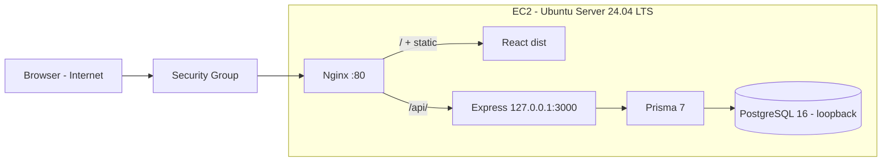
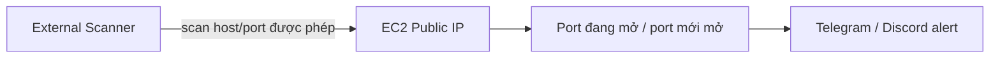

# Architecture v0.1 — PBL4-517

> Issue: [#11 — DOC-01: Create Architecture v0.1](https://github.com/LVTIT/PBL4-517/issues/11).
> Ngày tạo file: 2026-09-20. Trạng thái: bản nháp v0.1 để nhóm review trước khi close issue.
> Kiến trúc canonical lâu dài được duy trì tại [wiki/ARCHITECTURE.md](../../wiki/ARCHITECTURE.md).
> File này là snapshot v0.1 lưu trong `docs/architecture/` theo yêu cầu issue, không thay thế wiki.

## 1. Mục tiêu

Vẽ sơ đồ kiến trúc ban đầu của toàn hệ thống để cả 3 thành viên thống nhất
hướng triển khai W1–W2: website chạy trên EC2, scanner quét từ bên ngoài,
alert qua Telegram/Discord.

## 2. AWS side — website trên EC2

Luồng: browser gọi Public IP → Security Group cho qua port 80 →
Nginx phục vụ file static frontend, reverse proxy `/api/` giữ nguyên prefix
tới backend → backend truy vấn PostgreSQL qua loopback.

## 3. Scanner side và alert flow

Luồng: scanner chạy từ mạng bên ngoài, quét port của EC2 trong phạm vi cho
phép → lần đầu ghi nhận và cảnh báo port đang mở → các lần sau phát hiện
port mới mở và gửi cảnh báo. Port mở là kết quả giám sát mạng, chưa chứng
minh lỗ hổng ứng dụng. Scanner không truy cập database website.

## 4. Thành phần

| Thành phần | Vai trò trong v0.1 |
| --- | --- |
| Browser / Internet | Người dùng truy cập website qua Public IP |
| VPC / Subnet / Internet Gateway | Mạng AWS chứa EC2 (chi tiết ở issue #12) |
| Security Group | Chỉ mở port cần thiết: 22 (SSH, giới hạn IP quản trị), 80 (HTTP) |
| EC2 Ubuntu Server 24.04 LTS | Máy chủ duy nhất chạy toàn bộ website (issue #6, #12) |
| Nginx | Phục vụ `frontend/dist/`, proxy `/api/` (issue #14) |
| React dist + Express + Prisma + PostgreSQL | Website thương mại điện tử, chi tiết ở [website/README.md](../../website/README.md) |
| External Scanner | Quét port từ bên ngoài, source ở `scanner/` (issue #9, #10) |
| Telegram / Discord alert | Nhận cảnh báo port mở/mới mở (issue backlog alerts) |

## 5. Ranh giới v0.1

Có trong v0.1: một EC2 phục vụ trực tiếp qua Nginx; session PostgreSQL;
cookie HttpOnly + CSRF theo secure baseline trên `main`.

Chưa trong v0.1 (giai đoạn mở rộng): Application Load Balancer, chi tiết
VPC/subnet/NACL, TLS/HTTPS, cấu hình `trust proxy` production — thuộc các
issue #12–#17 khi triển khai thật và có evidence.

## 6. Đối chiếu checklist issue #11

- [x] Vẽ AWS side (mục 2).
- [x] Vẽ scanner side (mục 3).
- [x] Vẽ alert flow (mục 3).
- [x] Thống nhất với nhóm (đã được tick trong issue trước khi tạo file).
- [x] Lưu vào `docs/architecture/` (chính file này).

DoD còn lại do con người xác nhận: cả 3 thành viên đọc file này và confirm
hiểu sơ đồ, sau đó close #11. File này không tự đóng issue.

## 7. Bước tiếp theo

- #12 Configure EC2 Web Environment, #13 Prepare Website, #14 Deploy.
- #9/#10 Scanner Fundamentals và Prototype bám luồng mục 3.
- Mọi thay đổi kiến trúc sau v0.1 phải ghi decision mới trong
  [wiki/DECISIONS.md](../../wiki/DECISIONS.md), không sửa lịch sử v0.1.
