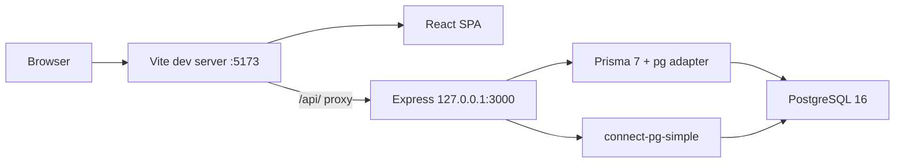
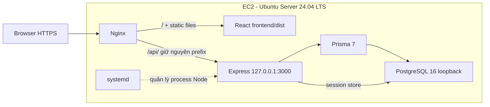
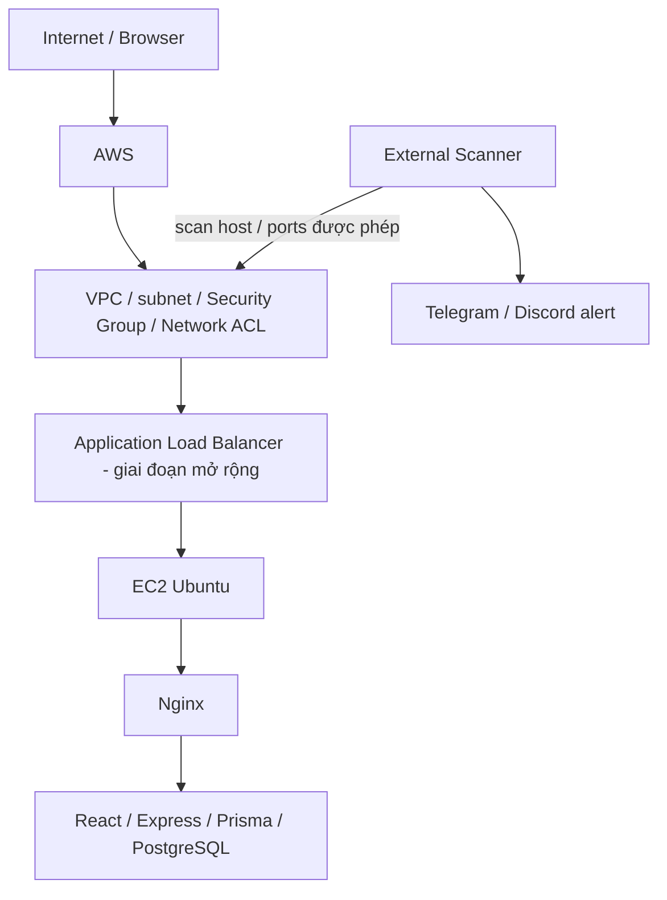

# Architecture

## Website local — Issue #8

**Status: Implemented trong source; trạng thái kiểm thử/DoD xem [CURRENT_STATUS.md](CURRENT_STATUS.md).**

Frontend gọi `/api/...` bằng relative URL. Express tách routes, controllers, services, middleware và database client; `server.ts` chỉ khởi động/dừng server. PostgreSQL chứa user, product và session. Danh sách sản phẩm đi qua Prisma; giá dùng Decimal. Session cookie HttpOnly trỏ tới session phía server; login/logout kiểm tra CSRF token. Hợp đồng API và cách chạy ở [website/README.md](../website/README.md).

## Website production trên EC2

**Status: Planned.** Source Issue #8 hỗ trợ kiến trúc này; chưa có Nginx config, systemd service hay bằng chứng EC2 trong scope Issue #8.

Nginx phục vụ static frontend và reverse proxy API; SPA fallback chỉ áp dụng cho frontend. Backend chạy JavaScript đã compile bằng Node, không dùng `tsx` trong production. Database và backend bind loopback; frontend không cần thay URL API. Cookie Secure yêu cầu HTTPS; `trust proxy` phải khớp proxy thật sự kiểm soát. Chi tiết cấu hình triển khai thuộc các issue EC2/Linux tiếp theo.

## PBL4 tổng thể

**Status: Planned.** Sơ đồ dưới đây biểu diễn phạm vi mạng và trách nhiệm, không coi VPC/Security Group/NACL là các server nối tiếp.

Giai đoạn đầu có thể phục vụ trực tiếp qua Nginx trên EC2; ALB thuộc giai đoạn mở rộng đã nêu trong đề tài, chưa triển khai. Cấu hình SG/NACL, subnet, TLS và chuỗi trust proxy phải được xác minh khi triển khai. Scanner chạy từ bên ngoài và không cần truy cập database website.

Tài liệu này lưu kiến trúc lâu dài; chưa thay thế checklist/evidence của [Issue #11 — Architecture v0.1](https://github.com/LVTIT/PBL4-517/issues/11). Các bước EC2, deploy, Linux service, kiểm thử và tài liệu triển khai nằm ở Issues [#12](https://github.com/LVTIT/PBL4-517/issues/12)–[#17](https://github.com/LVTIT/PBL4-517/issues/17); kiểm tra từng issue trước khi triển khai.
